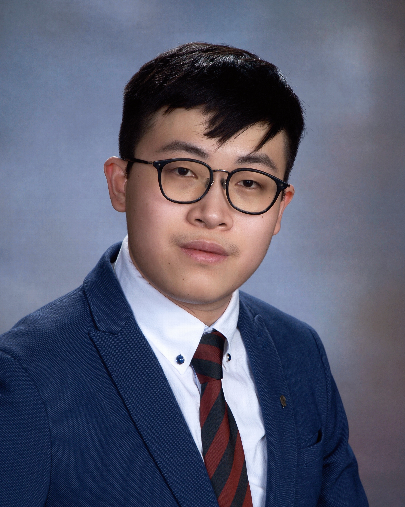

```{r setup, include=FALSE}
knitr::opts_chunk$set(echo = FALSE)

# Learn more about creating websites with Distill at:
# https://rstudio.github.io/distill/website.html
```

# About me

<br>

<center>

{width="50%"}

</center>

My name is Lawrence Xiaohua Li. I was born in Auckland, New Zealand. I studied at Bucknell University from 2018 to 2022. I love photography and making videos. I also play piano and compose music songs during my high school. I am also a gamer who loves to play a variety of singleplayer games and triple-A titles. I am interested in machine learning, software engineer in AI systems, and data science and analytics.

I am currently a rising graduate student, proficient in software development using popular IDEs such as PyCharm, IntelliJ IDEA, and vim, proficient in teamwork-based development and git-based version control system, confident with machine learning and image processing using matplotlib, keras, numpy, and tensorflow. I am also proficient in data visualizations using R and ggplot, as well as econometrics and data analytics using Stata.

# Programming Languages

### Python, Java, Go, R, MATLAB

# Software Skills

### Stata, PyCharm, IntelliJ IDEA, vim, GoLand, Visual Studio Code, RStudio

# Spoken Languages

### English (proficient), Mandarin (native), Cantonese (limited)


